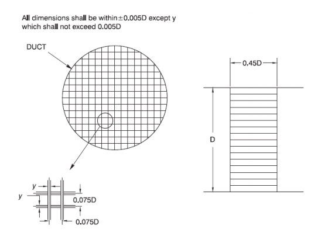

## Theory

The standard test set-up suitable for fans with both inlet and outlet ducts or with outlet duct only. In the case of fans with inlet duct only, the set-up would be slightly modified with the test duct on the inlet of the fan. For fans with no inlets and outlet ducts, the test setup incorporates a chamber, but this test is not usually necessary for mine fans since most mine fans are installed with inlet and outlet ducts.

 
 
            
Figure 1: AMCA standard fan testing set up

          

          
 
            
Figure 2: Egg-crate straightener

          

The test duct has a minimum length of 10 diameters and is connected to the outlet of the fan by a connecting piece whose sides should not converge at an angle greater than 0.26 rad (15°) or diverge at an angle exceeding 0.123 rad (7°). The diameter of the duct should be such that its cross-sectional area does not exceed that of the fan outlet by more than 12.5% nor should it be less than the cross sectional area at the fan outlet by more than 7.5%. The duct should be straight and of perfect shape. The tolerable limit of roundness for circular ducts at the traverse section is ±0.5% of the diameter and this limit should hold good for a distance of at least D/2 on either side of the traverse plane. An egg-crate straightener (figure 2) is used in the duct for straightening air flow. A diffuser cone (as shown by dotted lines in figure 1) at the outlet end of the duct may be used in order to approach more nearly free delivery conditions. The dotted line at the fan inlet indicates an inlet bell which may be used to simulate inlet duct condition. The friction loss in the inlet bell however is not considered in test calculations. Variation of quantity circulated by the fan is done by a symmetrical throttling device provided at the outlet of the duct.

#### Instruments
1. AMCA standard fan testing setup
2. Askania Minimeter
3. Inclined tube manometer
4. Pitot static tube
5. Wattmeter
6. Stroboscope
7. Assmann Psychrometer
8. Aneroid barometer
9. Scale and caliper

## Demo

            <iframe width="560" height="315" src="http://www.youtube.com/embed/8feKqspo5ZE" frameborder="0" allowfullscreen></iframe>
          

