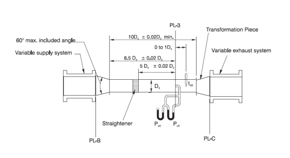

## Theory

The standard test set-up suitable for fans with both inlet and outlet ducts or with outlet duct only. In the case of fans with inlet duct only, the set-up would be slightly modified with the test duct on the inlet of the fan. For fans with no inlets and outlet ducts, the test setup incorporates a chamber, but this test is not usually necessary for mine fans since most mine fans are installed with inlet and outlet ducts.

The test duct has a minimum length of 10 diameters and is connected to the outlet of the fan by a connecting piece whose sides should not converge at an angle greater than 0.26 rad (15°) or diverge at an angle exceeding 0.123 rad (7°). The diameter of the duct should be such that its cross-sectional area does not exceed that of the fan outlet by more than 12.5% nor should it be less than the cross sectional area at the fan outlet by more than 7.5%. The duct should be straight and of perfect shape. The tolerable limit of roundness for circular ducts at the traverse section is ±0.5% of the diameter and this limit should hold good for a distance of at least D/2 on either side of the traverse plane. An egg-crate straightener (figure 2) is used in the duct for straightening air flow. A diffuser cone (as shown by dotted lines in figure 1) at the outlet end of the duct may be used in order to approach more nearly free delivery conditions. The dotted line at the fan inlet indicates an inlet bell which may be used to simulate inlet duct condition. The friction loss in the inlet bell however is not considered in test calculations. Variation of quantity circulated by the fan is done by a symmetrical throttling device provided at the outlet of the duct.

 
            
Figure 1: AMCA standard fan testing set up

          

 
            
Figure 2: Egg-crate straightener

          

Rating test aims at finding out the fan static and total pressures, power input to the fan and total efficiency of the fan for various flow rates at the rated speed so that the fan characteristics can be drawn. Static efficiency may also be calculated. With variable speed fans, all these readings are taken for different fan speeds. The results are stated for the inlet air density during the test. The necessary measurements are (a) static pressure and (b) velocity pressure (from which the velocity and hence the quantity can be calculated) at the traverse section, (c) the rotational speed of the fan, (d) power input to the fan, (e) barometric pressure, (f) dry and wet-bulb temperatures on the path of the inflowing air and (g) dry bulb temperature at the traverse section. The static pressure and the velocity pressure are measured by a Pitotstatic tube connected to two manometers as shown in figure 1. Pressures greater than 500 Pa are usually measured by vertical Utube water gauges graduated in millimeters whereas lower pressures should be measured on an inclined manometer having a least reading of 1-2.5 Pa. The inclined manometer should be calibrated against a sensitive micro-manometer. The pilot-static tube should be of the standard hemispherical-head type to be described later. It should not have a stem diameter less than 2.5 mm, neither should the stem diameter exceed one-thirtieth of the test-duct diameter. Ten readings should be taken along each of two diameters of the duct at right angles to each other at the traverse section, the measuring points being located at distances of 0.052, 0.163, 0.293, 0.452 and 0.684 times the radius of the duct from the wall with a tolerance of 0.5% of the radius. Whereas the average static pressure is given by the arithmetic mean of the static pressure readings at the points of observation, the average velocity pressure can also be calculated. The fan velocity pressure is the velocity pressure at the fan outlet and can be calculated from the relation.

$$ P_v = P_{vo}(\frac{A_0}{A})^2 \frac{ \rho_0}{\rho_f} -------- (1) $$

where,
Pv = fan velocity pressure,

Pv0= velocity pressure in the duct,

A0= cross-sectional area of the duct,

A = cross-sectional area of the fan outlet,

ρ0 = density of air in the duct and

ρf = density of air at the fan outlet.

Normally ρ0 can be taken as equal to ρf.

Velocity of air in the duct can be found from the relation.

$$ V_0 = \sqrt(2P_v - \frac {0}{\rho_0}) -------- (2) $$ 

where,
v0 = velocity in ms−1
Pv0 = velocity pressure in Pa and
ρ0 = air density in the duct in kg m−3
ρ0 is obtained from the relation

$$ \rho_0 = \rho (\frac{T}{T_0})(\frac{B+P_s}{B}) ------- (3) $$

Where ρ is the density of the air at the fan inlet, T and T0 are the dry-bulb temperatures at the fan inlet and in the duct respectively, B is the barometric pressure measured in the duct in Pa.

T0,T,B and Ps are measured, the barometer reading, of course, being corrected for temperature whereas ρ can be easily calculated. For fans generating up to 1 kPa pressure, ρ0 can be taken equal to ρ. The quantity circulating in the duct can be calculated by multiplying v0 by A0.

The fan total pressure indicates the total pressure at the outlet of the fan and can be calculated by adding the pressure loss in the intervening duct as well as that in the straightener to the sum of the static and the velocity pressures measured in the duct. Pressure loss in the duct is given by the relation

$$ P_1 =0.02 (\frac{L}{D}P_{v0_}) -------- (4) $$

where,
P1 = Pressure loss due to friction in the duct,

L = length of duct between the fan outlet and the traverse section,

D = diameter of the duct and

Pv0 = velocity pressure in the duct.

Pressure loss in the straightener, P2 is given by the relation

$$ P_2 = 0.08P_{v0} -------- (5) $$

The fan static pressure is found out by algebraically subtracting the fan velocity pressure from the fan total pressure. The fan quantity (quantity at the fan inlet) is calculated from the relation.
 
 $$ Q =Q_0(\frac{ \rho_0}{\rho}) -------- (6) $$

Where Q = quantity at the inlet and Q0 = quantity in the duct.

#### Instruments
1. AMCA standard fan testing setup
2. Askania Minimeter
3. Inclined tube manometer
4. Pitot static tube
5. Wattmeter
6. Stroboscope
7. Assmann Psychrometer
8. Aneroid barometer
9. Scale and caliper

## Demo

<!-- blank line -->
<figure class="video_container">
  <iframe src="http://www.youtube.com/embed/8feKqspo5ZE" frameborder="0" allowfullscreen="true"> </iframe>
</figure>
<!-- blank line --> 

